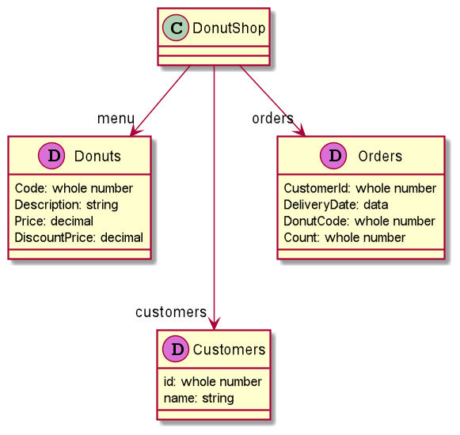

# dataframe-ec-kata
Code kata: becoming familiar with the features of the [dataframe-ec framework](https://github.com/vmzakharov/dataframe-ec) through hands-on exercises. 

### What Is a Code Kata?
A code kata is an exercise in programming which helps programmers hone their skills through practice. A code kata is usually set up as a series of unit tests, which fail. Your task is to write code to make them pass. The idea is inspired by the Japanese concept of kata in the martial arts. Just like in the martial arts, you can repeat a kata multiple times to make improvements to your solutions.

### Kata Domain: Donut Shop
This kata is very much inspired by the [Eclipse Collections Donut Kata](https://github.com/BNYMellon/CodeKatas/tree/master/donut-kata)

A donut shop has a number of clients, it sells a variety of donuts, and it accepts orders from its clients for donut deliveries. 

It can be described by this "domain model". 

All the entities marked with the "D" icon are configured in the test code in the [`DonutShopTest`](./donut-kata/src/test/java/io/github/vmzakharov/ecdataframekata/donutshop/DonutShopTest.java) class as Data Frames accessible from an instance of the [`DonutShop`](./donut-kata/src/main/java/io/github/vmzakharov/ecdataframekata/donutshop/DonutShop.java) class. 

### Getting Started
The kata uses Java version 17.

There are failing tests in the [`DonutShopTest`](./donut-kata/src/test/java/io/github/vmzakharov/ecdataframekata/donutshop/DonutShopTest.java) test class. Make the tests pass by following the instructions in the TODO comments in that class and in the [`DonutShop`](./donut-kata/src/main/java/io/github/vmzakharov/ecdataframekata/donutshop/DonutShop.java) class. Pay attention to Hints that may appear next to TODOs. 

There is a [solutions module](./donut-kata-solutions) in case you want to compare your solutions with others or if you get stuck.
